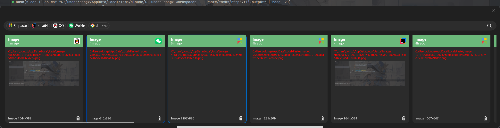
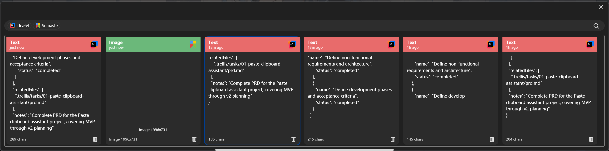

# Paste - Windows 剪切板助手

## 1. 项目概述

| 项 | 值 |
|---|---|
| 项目名称 | Paste |
| 平台 | Windows 10/11 |
| 技术栈 | C# + WPF (.NET 8) |
| UI 风格 | Fluent Design（Windows 11 原生风格：圆角、云母材质、Fluent 图标） |
| 交互模式 | 系统托盘常驻 + 快捷键呼出主窗口 |

## 2. 核心功能

### 2.1 剪切板监听与历史记录
- 后台监听系统剪切板变化，自动记录复制内容
- 支持内容类型：纯文本、富文本、图片、文件路径、颜色值
- 历史记录列表按时间倒序排列，支持搜索和筛选
- 可配置历史记录自动清理周期（如 1 天 / 7 天 / 30 天 / 永不）
- **收藏的内容不受自动清理影响，永久保留**

### 2.2 来源应用识别
- 记录每条剪切板内容的来源应用程序
- 在历史记录列表中显示来源应用的图标
- 支持按来源应用筛选历史记录

### 2.3 智能内容识别
- **颜色识别**：识别 HEX (#FF5733)、RGB、HSL 等颜色格式，在条目旁显示颜色预览色块
- **链接识别**：识别 URL，提供"在默认浏览器中打开"的快捷操作
- **内容类型标记**：自动识别并标记内容类型（文本、代码、链接、颜色、邮箱、电话等）

### 2.4 收藏系统
- 支持将任意剪切板条目收藏
- **自定义收藏文件夹**：
  - 创建 / 删除 / 重命名文件夹
  - 每个文件夹可设置颜色标记（颜色区分）
  - 支持将内容移动到不同文件夹
- 收藏内容永久保留，不受自动清理策略影响

### 2.5 快捷键
- 全局快捷键呼出/隐藏主窗口（默认可选 Alt+V 或类似）
- **支持用户自定义更换快捷键**
- 列表中的快捷操作（粘贴、收藏、删除等）

### 2.6 快速粘贴
- 在历史记录中选中条目可快速粘贴到当前活动窗口
- 支持双击或回车键快速粘贴

## 3. 高级功能

### 3.1 文本转换处理
- **去除格式粘贴**：将富文本转为纯文本粘贴
- **文本格式转换**：
  - 大小写转换（全大写 / 全小写 / 首字母大写）
  - 半角 ↔ 全角转换
  - 繁体 ↔ 简体中文转换
- **代码美化/格式化**：
  - JSON 格式化 / 压缩
  - XML 格式化
  - SQL 格式化
  - 代码语法高亮显示

### 3.2 数据持久化
- 使用本地数据库（SQLite）存储剪切板历史
- 应用重启后历史记录不丢失
- 图片等二进制内容存储在本地文件系统，数据库存引用路径

### 3.3 多设备同步（v2 规划，首版不实现）
- 预留同步接口设计
- 具体同步方案后续确定

## 4. UI/UX 设计要求

### 4.1 整体风格
- 遵循 Windows 11 Fluent Design 设计语言
- 圆角卡片、云母（Mica）/ 亚克力（Acrylic）背景材质
- Fluent System Icons 图标体系
- 支持亮色 / 暗色主题（跟随系统设置）

### 4.2 主窗口布局
- 左侧：导航栏（全部历史、收藏夹文件夹列表、设置）
- 右侧：内容列表区
  - 每个条目显示：内容预览 + 来源应用图标 + 时间 + 类型标签
  - 颜色类型条目显示颜色预览色块
  - 链接类型条目显示快速打开按钮
- 顶部：搜索栏 + 筛选器

### 4.3 系统托盘
- 最小化时隐藏到系统托盘
- 托盘右键菜单：显示窗口、暂停监听、设置、退出
- 托盘图标使用应用 Logo

### 4.4 设置页面
- 快捷键配置
- 历史记录自动清理周期
- 开机自启动开关
- 主题切换（亮/暗/跟随系统）
- 数据存储路径配置
- 语言设置（中文/英文）

## 5. 非功能性需求

### 5.1 性能
- 剪切板监听响应延迟 < 100ms
- 窗口呼出响应 < 200ms
- 搜索 10000 条记录 < 500ms
- 内存占用常驻 < 50MB
- CPU 后台空闲时接近 0%

### 5.2 可靠性
- 应用崩溃后可自动恢复监听
- 数据库操作使用事务保证一致性
- 异常情况下不丢失已保存数据

### 5.3 兼容性
- Windows 10 (1903+) 及 Windows 11
- 高 DPI / 多显示器支持
- 4K 分辨率下 UI 正常显示

## 6. 技术架构概要

```
Paste/
├── src/
│   ├── Paste.Core/           # 核心业务逻辑层
│   │   ├── Models/           # 数据模型
│   │   ├── Services/         # 业务服务（剪切板监听、内容识别等）
│   │   └── Interfaces/       # 接口定义
│   ├── Paste.Data/           # 数据访问层
│   │   ├── Database/         # SQLite 数据库操作
│   │   └── Storage/          # 文件存储（图片等）
│   ├── Paste.UI/             # WPF 界面层
│   │   ├── Views/            # XAML 视图
│   │   ├── ViewModels/       # MVVM ViewModel
│   │   ├── Controls/         # 自定义控件
│   │   ├── Themes/           # Fluent 主题资源
│   │   └── Converters/       # 数据转换器
│   └── Paste.App/            # 应用入口
│       ├── App.xaml
│       └── Configuration/    # 应用配置
├── tests/                    # 单元测试
├── assets/                   # 图标、图片资源
└── Paste.sln                 # 解决方案文件
```

**关键技术选型**：
- .NET 8 + WPF
- MVVM 架构模式（使用 CommunityToolkit.Mvvm）
- SQLite（通过 EF Core 或 Dapper）
- WPF-UI 或 ModernWpf 实现 Fluent Design
- 全局快捷键：Win32 API RegisterHotKey

## 7. 开发优先级（MVP → 完整版）

### Phase 1 - MVP（核心可用）
1. 系统托盘常驻 + 快捷键呼出窗口
2. 剪切板监听与历史记录
3. 来源应用识别与图标显示
4. 基本搜索功能
5. 快速粘贴
6. SQLite 持久化存储

### Phase 2 - 增强体验
7. 颜色识别与预览
8. 
8. 链接识别与快速打开
9. 收藏系统（文件夹 + 颜色标记）
10. 自定义快捷键
11. 历史记录自动清理设置
12. 亮/暗主题切换

### Phase 3 - 高级功能
13. 文本转换（去格式、大小写、繁简体）
14. 代码美化/格式化
15. 设置页面完善
16. 开机自启动
17. 多语言支持

### Phase 4 - 远期规划
18. 多设备同步
19. 插件系统（可选）

## 8. 验收标准

- [ ] 应用可常驻系统托盘，快捷键正常呼出/隐藏窗口
- [ ] 复制内容后自动出现在历史记录中，来源应用图标正确显示
- [ ] 颜色值能被正确识别并显示色块预览
- [ ] URL 可一键在浏览器中打开
- [ ] 收藏文件夹创建/重命名/颜色设置功能正常
- [ ] 收藏内容不会被自动清理
- [ ] 快捷键可自定义更换
- [ ] 文本转换功能正常工作
- [ ] 重启应用后历史数据不丢失
- [ ] UI 遵循 Fluent Design，亮暗主题切换正常
- [ ] 性能满足非功能性需求指标

## 9. 异常处理
- 有一种图片能预览
  
  
- 多了一个灰色的方框, 点击内容后方框又会消失 (已修复)

